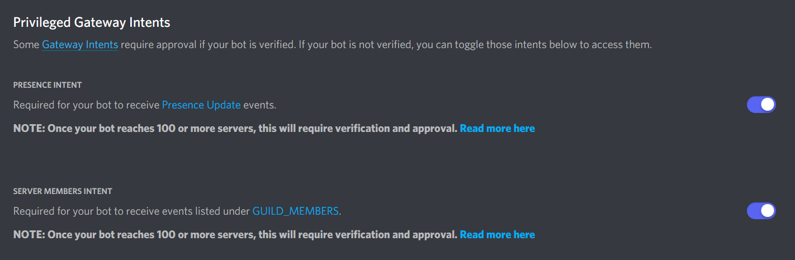

# CHAOS DISCORD BOT

## SETUP

### DEVELOPMENT

- Run following commmands:

```
npm install
```

- Prerequisites:
  | TOOL/ PACKAGE | VERSION |
  |---------------|---------|
  | Node.js | 16.6.1 |

### DEPLOYMENT

- Copy `local.config.json` to `config.json` then supply all required configs.
- From `src\database\config`, copy `local.database.json` to `database.json` then update `production` config
- Run following commands for database:

```
> npx sequelize-cli db:migrate
> npx sequelize-cli db:seed:all

// Optional command to run for seeding with the use of specific files

> npx sequelize-cli db:seed --seed "seed-filename.js"
```

### DISCORD APPLICATION CONFIGURATION

- From [discord application](https://discord.com/developers/applications) dashboard (select your application first):
  - Get the following tokens:
    - From `OAuth2` tab, copy `CLIENT ID` for `CLIENT_ID` in `.env`
    - From `Bot` tab, copy `TOKEN` for `BOT_TOKEN` in `.env`
- Toggle the following privilege intents to `active` under `Bot` tab:
  
- Make sure the bot application when added to the discord server have the following permissions:
  - View Channels
  - Manage Roles
  - Send Messages
- Or just give the bot `Administrator` permission for convenience.
- Make sure to remove roles from the bot application with conflicting permissions and update channel settings.


